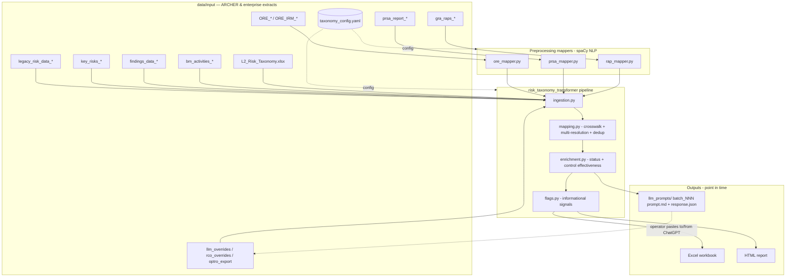

# LUminate — Methodology & Design

Single source of truth for **what LUminate does, why it works this way, and the
rules it applies.** Merges the former BRD, Technical Design, Method
Justification, Rule Set, and Limitations Register. Other docs point here rather
than restating.

Deep code-level reference (detail of record, not duplicated):
`reference/data_flow.md` (relocated from `config/` and re-verified 2026-06-12).
Former companions `AUDIT_INPUTS_DATAFLOW.md`, `methodology_reference.md`, and
`decision_tree.md` were stale and retired to `../archive/superseded_docs/`
2026-06-12; their still-current facts live in `reference/data_flow.md`, the
Rule Set here (Part 4), and `risk_taxonomy_transformer/methodology.yaml`.

---

# Part 1 — Purpose & Requirements

## 1.1 Problem statement

The enterprise is migrating audit-entity risk assessments from a legacy
taxonomy (14 pillars) to a new AERA taxonomy — 6 L1 / 23 *evaluated* L2 of a
24-risk taxonomy (Earnings, Reputation, Country are "Not Assessed" and generate
no rows). Done manually this is ~10,000 applicability decisions across 450+ audit
entities, with no consistent evidence base and high reviewer effort. LUminate provides an evidence-based
starting position for each (entity × L2) so teams react to a proposal rather
than build from zero.

## 1.2 Objectives

- Produce, per (entity × L2), a proposed applicability status with a traceable
  decision basis and consolidated control-issue evidence.
- Improve consistency, efficiency, and defensibility of the migration.
- Keep the human as the decision-maker; Optro remains the system of record.

## 1.3 Functional requirements

| ID | Requirement | Source authority |
|---|---|---|
| FR-1 | Deterministically map each legacy pillar to new L2(s) via a config-driven crosswalk. | Methodology owner |
| FR-2 | Carry legacy ratings forward **only** on 1:1 direct mappings; blank otherwise. | SVP 2026-04-07 |
| FR-3 | Resolve multi-target mappings using keyword evidence over rationale + key-risk text, banded into confidence levels. Keyword sets RCO-vetted (validation in progress, not 23/23 — §4 open items). | Methodology / RCOs |
| FR-4 | Confirm applicability from open IAG findings tagged to an L2. | Phase 1 design (orig. `risk_assessment_workflow.md`, retired) |
| FR-5 | Accept AI-assisted applicability overrides for ambiguous rows as advisory input the auditor confirms/rejects. | Phase 1 design |
| FR-6 | Consolidate control-issue evidence (findings, OREs legacy+IRM, PRSA, RAPs, BMA) into an Impact-of-Issues view per L2. | Phase 1 design (orig. `risk_assessment_workflow.md`, retired) |
| FR-7 | Surface unmappable / untagged upstream items rather than dropping them silently. | `../luminate_disclaimers.md` |
| FR-8 | Emit informational signal flags (app/TP, auxiliary, control contradiction, cross-boundary) that never change status. | Phase 1 design (orig. `decision_tree.md`, retired) |
| FR-9 | Output a timestamped Excel workbook + HTML report with methodology/disclaimer banners. | Phase 1 design |
| FR-10 | Accept RCO and Optro overrides per documented precedence. | Phase 2 |

## 1.4 Non-functional requirements

- **Human-in-the-loop:** advisory; no automated downstream consumer.
- **Traceability:** every row carries method, confidence, evidence; LLM step
  persists exact prompt + response per batch; run provenance stamped into
  outputs (§ Part 2.7).
- **Point-in-time:** outputs are frozen artifacts cited by run timestamp.
- **Config-driven:** taxonomy, crosswalk, keywords, column maps in
  `taxonomy_config.yaml` — no code change to adjust rules.
- **Reproducibility:** mostly closed (Part 2.7 residual table) — direct deps +
  canonical model pinned; residual is the absent transitive lockfile.

## 1.5 Explicitly out of scope

Replacing auditor judgment; automating final ratings; hosted infrastructure
(stays a local script); cross-AE roll-ups / heatmaps; inverse inventory-vs-RC
disconnect detection; cross-source ORE dedup; upstream data-quality validation;
programmatic BMA→L2 attribution. Full list: `../luminate_disclaimers.md`
"What LUminate explicitly does not do".

## 1.6 Success criteria (acceptance)

| Metric | Target | Source |
|---|---|---|
| Pilot leader validates workbook usable + proposals reasonable | Yes/No gate | `../PHASE2_SCOPE.md:82` |
| RCO keyword validation complete | 23/23 L2 | `../PHASE2_SCOPE.md:83` |
| Resolution rate (rows resolved with evidence) | Baseline; expect >70% | `../PHASE2_SCOPE.md:84` |
| Dropped findings after normalization fix | <10 unmappable | `../PHASE2_SCOPE.md:86` |
| Sample reconciliation variances explained | 100% explained | Validation §Reconciliation |

## 1.7 Key decisions log (authority trail)

| Date | Decision | By |
|---|---|---|
| 2026-04-07 | Stop carrying legacy ratings unless direct 1:1; blank otherwise | SVP |
| 2026-04-07 | Use RCO rating guidance where it exists; accept guidance input | SVP |
| 2026-04-07 | Align AE-to-RCO mapping | SVP |
| 2026-04-21 | 24-risk taxonomy; Country & Reputational "Not Assessed" | Matt |
| 2026-05-01 | Fraud at L3 grain; External Fraud rating not carried forward | Matt |
| 2026-05-16 | Canonical NLP model corrected to `en_core_web_lg` | EUC owner |

Unratified values still needing a named authority: confidence threshold = 3,
NLP similarity = 0.50, BMA cutoff 2025-07-01 (§4 open items).

---

# Part 2 — Architecture & Technical Design

## 2.1 Architecture

Orchestration: `refresh.py` runs the four mappers then
`python -m risk_taxonomy_transformer`; `export_html_report.py` renders HTML
from the Excel output.

## 2.2 Components

| Component | Responsibility |
|---|---|
| `ore_mapper.py` / `prsa_mapper.py` / `rap_mapper.py` | spaCy `en_core_web_lg` similarity of source items vs. L2 definitions; band Suggested Match / Needs Review / No Match. |
| `ingestion.py` | Load + validate + normalize every source; build indices. |
| `mapping.py` | Apply crosswalk; resolve multi-target via keyword evidence + LLM overrides; deduplicate. |
| `enrichment.py` | Derive status from method; control-effectiveness baseline; Impact of Issues. |
| `flags.py` | Emit informational signal flags (never change status). |
| `export.py` / `export_html_report.py` | Excel/HTML output incl. methodology + disclaimer banners + run provenance. |
| `export_llm_prompts.py` / `consolidate_llm_responses.py` | LLM round-trip: structured prompt out, schema-validated CSV back. |
| `config.py` + `taxonomy_config.yaml` + `methodology.yaml` | Config + output methodology/banner content. |

## 2.3 Key design properties

- **Deterministic core.** Crosswalk + keyword scoring + dedup are deterministic
  and config-driven. NLP/LLM are advisory enrichment, not status authority.
- **Config separation.** Crosswalk, keywords, aliases, column maps in
  `taxonomy_config.yaml`; L2 alias map validated at startup.
- **Row invariant.** Every entity ends with exactly 23 L2 rows after gap-fill
  (`mapping.py:523-525`, `for l2 in L2_TO_L1:`).
- **Surface, don't drop.** Unmappable/untagged items captured to
  `Unmapped Findings` / `Upstream Tagging Gaps`.

## 2.4 Data flow (summary)

Ingest → normalize L2 names (alias map) → apply crosswalk per pillar → resolve
multi-target (LLM override → else keyword evidence → else no-evidence
fallback) → findings confirm applicability → dedup colliding (entity, L2) rows
→ gap-fill missing L2s → derive status → enrichment → flags → export. Full
per-source plumbing: `reference/data_flow.md`; status/method branching lives in
`mapping.py` + `constants.py` (the former `methodology_reference.md` §12 is
retired to `../archive/superseded_docs/`).

**PG gap attribution — dual-route union.** PG gaps (issues flagged `#PG` /
`PG` in IRM Archer) resolve to AEs via two independent bridges. Track C1 (the
default) is the legacy PRSA Frankenstein join: Issue → Control → Process ID →
PRSA → legacy `Audit Entity ID`. Track C2 (optional, enabled when
`project_guardian_aera_inputs_*.xlsx` is staged) is the PG team's per-Gap-ID
file: the gap's `Archer eGRC FND ID` joins to the findings extract's
`Finding ID`, and findings already carry `Audit Entity ID` plus
`Risk Dimension Categories`, so the FND_ID bridge resolves both AE and L2 in
one lookup. The two routes are **unioned** per `(entity, L2, Issue ID)` — a
single gap may render under every AE either route names. When both routes
resolve the same Issue ID at the same (AE, L2), the PRSA route wins on
metadata (severity = PRSA Issue Rating); the PG team's Impact Rating is used
only for PG-team-only rows (Issue IDs absent from the PRSA Frankenstein) or
when the PRSA Issue Rating is blank. Audit teams reading the workbook see
the same behaviour described on the **Methodology Detail tab** ("PG GAP
SOURCE" block, sourced from `risk_taxonomy_transformer/methodology.yaml`).
Source-by-source disclaimers including the diagnostic comparison script
(`scripts/compare_pg_mappings.py`) live in `../luminate_disclaimers.md`.

## 2.5 Status / method model

Canonical statuses: Applicable, Not Applicable, Assumed N/A — Verify,
Applicability Undetermined, No Legacy Source, Needs Review (fallback only).
Method→status mapping of record: `constants.py:16-50` + `review_builders.py`
(`_derive_status`). (Former `methodology_reference.md` §12.4 table retired.)

## 2.6 Interfaces

- **Inbound:** Excel/CSV in `data/input/`, glob by pattern, most-recent-by-mtime
  wins (planned change to filename-timestamp-first selection —
  `../IMPROVEMENT_PLAN.md` 1.1). No network/subprocess/env-vars/user-prompts
  (`reference/data_flow.md`).
- **Outbound:** timestamped Excel + HTML to `data/output/`, SharePoint manual,
  human-only consumption.
- **AI:** offline one-shot batch paste to ChatGPT; closed-schema CSV back,
  validated by `consolidate_llm_responses.py`.

## 2.7 Known technical residual risks

*(Single source of truth — other docs point here.)*

| Risk | Detail | Ref |
|---|---|---|
| Dependency reproducibility (mostly closed 2026-05-16) | `requirements.txt` pinned to exact installed versions (`pandas==3.0.1`, `openpyxl==3.1.5`, `PyYAML==6.0.3`, `spacy==3.8.14`) + pinned `en_core_web_lg-3.8.0` wheel. Provenance (tool commit, model+version, lib versions) logged to run log + Excel Methodology tab + HTML banner. **Residual:** no full transitive-dependency lockfile (owner declined as excessive for a transitional tool). | `requirements.txt`, `utils.get_run_provenance` |
| Silent read failures | Inventory read errors swallowed → empty DataFrame; report shows zero with no error. Mitigated only if `validate_inputs.py` is run. | `export_html_report.py:42-45` |
| BMA cutoff authority unattributed | Value `2025-07-01` is in YAML (`taxonomy_config.yaml:209` `min_completion_date`, read `ingestion.py:1314`); open item is the missing named approving authority, not a config gap. | §4 open items |
| Dual config loads | `config.py` cached load vs. ad-hoc reloads in mappers / `export_html_report.py`. Drift risk if one path patched. | `reference/data_flow.md` |
| Import-time side effects | `build_presentation.py` has no `__main__` guard (writes a .pptx on import). | (one-off slide builder, untracked) |
| Run log truncated | `logging.basicConfig(mode="w")` overwrites the log each run — no execution history. | `__main__.py:63` |
| AI variance | LLM outputs may shift between runs on identical inputs; documented advisory. | `../luminate_disclaimers.md:18` |

---

# Part 3 — Method Justification

*(Audience: EUC governance reviewer; Model-Risk non-model classification.)*

## 3.1 Integrity statement (read first)

**No formal or empirical comparison of alternative techniques was performed.**
Technique selection was design judgment by a single tool author who is not a
Python subject-matter expert. Alternatives were reasoned about at a design
level only; none were prototyped or benchmarked head-to-head. This is an
**accepted limitation**, not a controlled selection process.

Dispositioned (not eliminated) by five structural factors, each independently
verifiable:

1. **The NLP method does not decide applicability.** The deterministic YAML
   crosswalk + findings + explicit overrides set every row's Status. The spaCy
   mappers only band *supplementary control-issue evidence* (Impact-of-Issues).
   A weak similarity result misorders supplementary evidence; it does **not**
   produce a wrong applicability decision.
2. **Advisory, human decides every row.** No automated consumer; the auditor
   confirms/rejects and records in Optro.
3. **Deterministic given the pinned model.** Same inputs + pinned
   `en_core_web_lg-3.8.0` → same mapper output. No training, no learning.
4. **Limitations disclosed, not hidden.** The dominant mapper limitation
   ("Needs Review" dominance from textually-similar upstream L2 definitions) is
   in `../luminate_disclaimers.md` and surfaced in the workbook.
5. **Transitional scope.** A one-time migration aid; proportionate selection
   judged adequate to advisory, time-bounded use.

Single-author / non-SME authorship is recorded as an EUC key-person risk
(Governance §Inventory); mitigation is the independent reconciliation and
review (Validation Parts 2–3).

## 3.2 Selection criteria

In priority order: **no data egress** (offline/local; the bounded LLM step is a
deliberate exception, §3.4) · **determinism / defensibility** · **interpretability**
· **operational simplicity** (local script, runnable by a non-SME) ·
**proportionality** (effort matched to an advisory, human-reviewed tool). These,
not accuracy maximisation, governed the design.

## 3.3 Per-technique rationale

**Rule-based YAML crosswalk (backbone).** Legacy→L2 mapping is a defined
methodology decision, not an inference problem. Deterministic, config-resident,
methodology-owner-signable (Crosswalk_v1.0.md), changeable without code. This —
not the NLP — determines applicability.

**Substring keyword scoring (multi-target resolution).** Plain
case-insensitive substring matching against RCO-vetted lists, chosen for total
transparency. *Not chosen:* fuzzy/embedding keyword matching — trades the
explainability that is the point of this layer for recall the human review
does not need. Known cost (misspellings missed) accepted and documented.

**spaCy word-vector similarity (ORE/PRSA/RAP).** Cosine similarity of item
text vs. L2 definition text. Chosen: offline, dependency-light vs. transformer
stacks, deterministic given a pinned model, interpretable. Alternatives
reasoned about but **not trialed**:
- *TF-IDF / classical sparse vectors* — not prototyped (author not a Python SME
  and did not implement it). Design view: term-overlap is brittle on short
  jargon-dense definition text when source uses different vocabulary;
  pretrained vectors generalise without corpus fitting. Design rationale, **not
  an empirical finding** — no comparison run.
- *Transformer / sentence embeddings* — heavier dependency footprint, larger
  reproducibility surface, disproportionate for an advisory transitional tool.
  Set aside on proportionality, not measured accuracy.
- *LLM-only classification of all items* — rejected on volume, cost,
  non-determinism, and no-egress; the §3.4 variance/prompt risks would apply at
  full scale with no deterministic floor.

**`en_core_web_lg` vs `en_core_web_md`.** `lg` is canonical because it is the
model production runs actually used and is the more capable of the two readily
available spaCy English models (far larger vector vocabulary → fewer OOV
fallbacks on jargon). 

**LLM-assisted overrides (bounded, advisory).** Only for ambiguous (entity, L2)
rows the deterministic paths could not resolve: one-shot operator-mediated
batch, schema-validated, merged as one advisory column shown beside full source
rationale. A *bounded* exception to the no-API rule — deliberately not the
primary mechanism.

## 3.4 Governance position

LUminate's adequacy does not rest on the NLP being optimal. It rests on the
deterministic crosswalk being the decision backbone, the NLP being advisory
and bounded in blast radius, every row being human-decided, the environment
pinned and provenance-stamped, and limitations disclosed. **Fit for an
advisory, transitional migration aid; not adequate for an autonomous or
decision-making system, and not used as one.**

---

# Part 4 — Rule Set

Every decision rule in plain English with its authority. Code/detail of
record: `../config/decision_tree.md`, `../config/methodology_reference.md`.
`[CONFIRM]` authority = engineering default not yet ratified by a named
decision-maker → open items, close before governance approval.

## 4.A Status determination

| # | Rule | Authority |
|---|---|---|
| A1 | Pillar rated N/A → all mapped L2s = Not Applicable (high conf; reviewer pre-filled "Confirmed Not Applicable"). | Methodology — `../PROJECT_DECISIONS.md` "Source N/A = High Confidence" |
| A2 | Pillar with no rationale column (IT, InfoSec, Third Party) → all primary L2s Applicable, direct, high conf (no keyword scoring). | `../PROJECT_DECISIONS.md` "IT/InfoSec: Both Primary L2s" |
| A3 | Direct 1:1 mapping → single L2 Applicable; legacy rating carried forward. | SVP 2026-04-07 |
| A4 | Multi-target with rationale → score keywords; ≥3 hits = high, 1–2 = medium, 0 = not added (→ Assumed N/A — Verify). | Threshold `[CONFIRM — PROJECT_DECISIONS.md:48]` |
| A5 | Multi-target, no evidence for ANY candidate → all candidates Applicability Undetermined (low conf). | Methodology design |
| A6 | Open IAG finding tagged to L2 → Applicable, regardless of keyword result. | `../config/risk_assessment_workflow.md` |
| A7 | LLM override present for (entity, pillar, L2) → override decides; keyword scan skipped. Never trumps open findings. | Phase 1 design; `../luminate_disclaimers.md:127` |
| A8 | L2 with no pillar route → No Legacy Source (gap-fill). | Methodology design |
| A9 | Reputational & Country → no L2 rows ("Not Assessed"). | Matt 2026-04-21 |

## 4.B Rating

| # | Rule | Authority |
|---|---|---|
| B1 | Rating carries forward ONLY on direct 1:1; blank for all multi — **and blank on any pillar with `suppress_rating: true`** (B2, B5). | SVP 2026-04-07 |
| B2 | External Fraud rating not carried forward (`suppress_rating`; cannot split First Party vs Victim). | Matt 2026-05-01 |
| B3 | Dedup colliding (entity, L2): keep higher/more-conservative rating; annotate both sources. | `taxonomy_config.yaml`; methodology |
| B4 | Where RCO L2 rating guidance exists, use it (none exists today). | SVP 2026-04-07 |
| B5 | Strategic & Business → Capital: `direct` (applicability carries) + `suppress_rating: true` (rating blank, reviewer-set) — Option C. **Implemented + verified, pending Matt sign-off** (Crosswalk §"Strategic & Business"; sign-off item 1a). | EUC owner; pending Matt |

## 4.C Source filters (what gets dropped, why)

| # | Rule | Authority |
|---|---|---|
| C1 | IAG findings: only `Finding Approval Status == Approved`. | `../PROJECT_DECISIONS.md` "Findings Filters" |
| C2 | IAG findings: drop blank-severity rows. | ditto |
| C3 | Active findings = status in {open, in validation, in sustainability}; others view-only. | ditto |
| C4 | ORE: drop closed-status events at mapper stage; drop rows with no Event ID / no text / no AE. | `../config/methodology_reference.md` §4 |
| C5 | NLP mappers emit a single user-facing band: **"Needs Review"** for every item above the similarity floor (no positive-confidence band asserted, 2026-05-17). "Suggested Match" retained in the `*_confidence_filter` lists only for backward-compat with older workbooks. Track B `Source-Tagged` rows bypass this. | Design decision (EUC owner) |
| C6 | NLP similarity: No Match if top score < 0.50 (inclusion floor only — below it, item excluded). The former ambiguity-margin band (P25 clamp) is **removed** — no Suggested/Needs split, so no boundary to ratify. | 0.50 is a deliberately low inclusion floor; defensible without a numeric ratification |
| C7 | BMA: drop rows with Planned Completion Date < 2025-07-01 (NaT kept). | Value in YAML (`taxonomy_config.yaml:209`). `[CONFIRM — date not ratified by a named authority]` |
| C8 | GRA RAPs: drop blank-RAP-ID rows (entity-level placeholders). | `../config/methodology_reference.md` §6 |
| C9 | Unmappable L2 names → no row; captured to Unmapped Findings / Upstream Tagging Gaps. | `../luminate_disclaimers.md` |
| C10 | LLM override rows with invalid L2 or non-{applicable,not_applicable} → skipped + WARNING. | Methodology design (commit 2026-05-02) |

## 4.D Informational signals (never change status)

| # | Flag | Fires when | Authority |
|---|---|---|---|
| D1 | Control contradiction | Well Controlled + any active finding on L2; or Moderately Controlled + active High/Critical finding. | `../config/decision_tree.md`; `flags.py:62-130` |
| D2 | App/engagement | Entity has primary/secondary IT or TP columns populated and L2 ∈ {Technology, Data, InfoSec, Third Party}. | `../config/decision_tree.md` |
| D3 | Auxiliary risk | L2 in entity's AXP/AENB Auxiliary Risk Dimensions. | `../config/decision_tree.md` |
| D4 | Cross-boundary | Keyword for L2 X in a pillar not mapping to X, ≥2 hits. | Ratified — `taxonomy_config.yaml:7-24` documents the trade-off |

## 4.E Open authority items (close before governance approval)

1. **Keyword confidence threshold = 3** — `../PROJECT_DECISIONS.md:48`. Still
   open: affects *status* (0 hits → Assumed N/A), so it is decision-bearing.
   A rationale is drafted for the AERA methodology owner to accept or replace
   (see the Matt sign-off package).
2. ~~NLP similarity ambiguity band~~ all NLP output is "Needs Review"
   (§4.C5–C6). No threshold to ratify. The 0.50 inclusion floor remains and is
   defensible as a low floor, not a confidence boundary.
3. **BMA date cutoff 2025-07-01** — value in YAML; Currently set based on time period being during the last AERA refresh. Given all BM Activities should have been reflected in AERA already, opted for this to note relevant and more recent events.
4. **RCO keyword validation** — in progress, not 23/23 (`../PHASE2_SCOPE.md:43`).
5. **Strategic & Business → Capital, Option C** (B5) — implemented + verified
   (direct applicability, `suppress_rating`), **pending Matt sign-off**
   (package item 1a). On approval → Crosswalk v1.1 + version bump + CHANGELOG.

---

# Part 5 — Limitations

**Canonical register:** `../luminate_disclaimers.md` (maintained, source-by-
source, leadership-facing — *do not fork it*). Add new limitations there.

| Category | Where |
|---|---|
| Source-by-source caveats, filters, out-of-scope | `../luminate_disclaimers.md` (canonical) |
| Open methodology questions / unratified decisions | `../PROJECT_DECISIONS.md`, §4.E |
| Known edge cases per source | `../config/methodology_reference.md` ("Known edge cases") |
| Technical / residual risks | §2.7 (single source) |

Highest-severity (summary — canonical has the full list):

1. AI-assisted determinations advisory; may vary between runs.
2. LUminate cannot fix/create upstream attribution — untagged items surfaced, not invented.
3. Outputs point-in-time; cite by run timestamp.
4. Not a system of record — Optro is.
5. Reproducibility mostly closed (§2.7); residual = no transitive lockfile.
6. Mapper "Needs Review" dominance = upstream definition similarity, not a defect.
7. **Over-reliance on the proposal** — top residual: a busy reviewer confirms a
   wrong proposal → permanent Optro decision. Mitigated by reconciliation + UAT
   "reasonable on a known portfolio" check, not by the tool.
